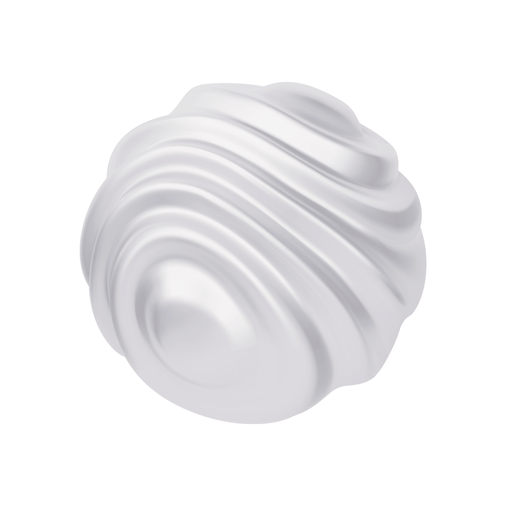

<div align="center">
  
  <h1>Oura</h1>
  <p><strong>The browser, reimagined with AI.</strong></p>

  <p>
    <a href="https://github.com/hsnrique/oura/releases"></a>
    <a href="LICENSE"></a>
    <a href="https://github.com/hsnrique/oura/stargazers"></a>
  </p>

  <br />
</div>

Oura is a modern, privacy-focused desktop browser with a built-in AI assistant powered by Google Gemini. Ask questions about any page, summarize articles, translate content — all without leaving your browser.

<br />

## ✨ Features

| | Feature | Description |
|---|---|---|
| 🤖 | **AI Assistant** | Chat with any webpage — summarize, explain, extract key facts, or translate |
| ⌘K | **Command Palette** | Quick navigation, tab switching, and instant actions |
| 📑 | **Smart Tabs** | Drag, pin, duplicate, and manage tabs effortlessly |
| 🔖 | **Bookmarks Bar** | Quick-access bookmarks with favicon display |
| 📥 | **Download Manager** | Built-in download tracking with progress indicators |
| 🕐 | **History Search** | Full-text search across your entire browsing history |
| 🔍 | **Persistent Zoom** | Per-domain zoom level memory |
| 🎬 | **Picture-in-Picture** | Watch videos while you browse |
| 🎨 | **Themes** | Dark and light mode |
| 🔒 | **Privacy-first** | Your data stays local in SQLite — nothing leaves your machine |

<br />

## 🚀 Getting Started

### Prerequisites

- [Node.js](https://nodejs.org) v18+
- npm

### Install & Run

```bash
git clone https://github.com/hsnrique/oura.git
cd oura
npm install
npm run dev
```

### Build for Distribution

```bash
npm run dist
```

The packaged `.app` / `.dmg` will be in the `release/` directory.

<br />

## ⌨️ Keyboard Shortcuts

| Shortcut | Action |
|----------|--------|
| `⌘T` | New tab |
| `⌘W` | Close tab |
| `⌘L` | Focus URL bar |
| `⌘K` | Command palette |
| `⌘J` | Toggle AI panel |
| `⌘F` | Find in page |
| `⌘Y` | History |
| `⌘⇧B` | Toggle bookmarks bar |
| `⌘,` | Settings |
| `⌘/` | Keyboard shortcuts |

<br />

## 🛠 Tech Stack

<table>
  <tr>
    <td align="center"><strong>Electron</strong><br/><sub>Desktop framework</sub></td>
    <td align="center"><strong>TypeScript</strong><br/><sub>Type-safe codebase</sub></td>
    <td align="center"><strong>Vite</strong><br/><sub>Fast build tooling</sub></td>
    <td align="center"><strong>Gemini</strong><br/><sub>AI assistant</sub></td>
    <td align="center"><strong>SQLite</strong><br/><sub>Local storage</sub></td>
  </tr>
</table>

<br />

## 📄 License

[MIT](LICENSE) — Free to use, modify, and distribute with attribution.

<br />

<div align="center">
  <sub>Made with ♥ by <a href="https://github.com/hsnrique">Henrique Martins</a></sub>
</div>
